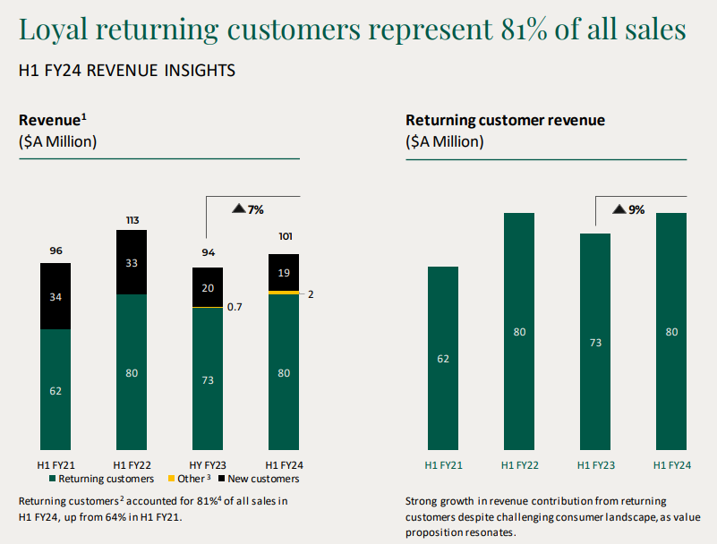
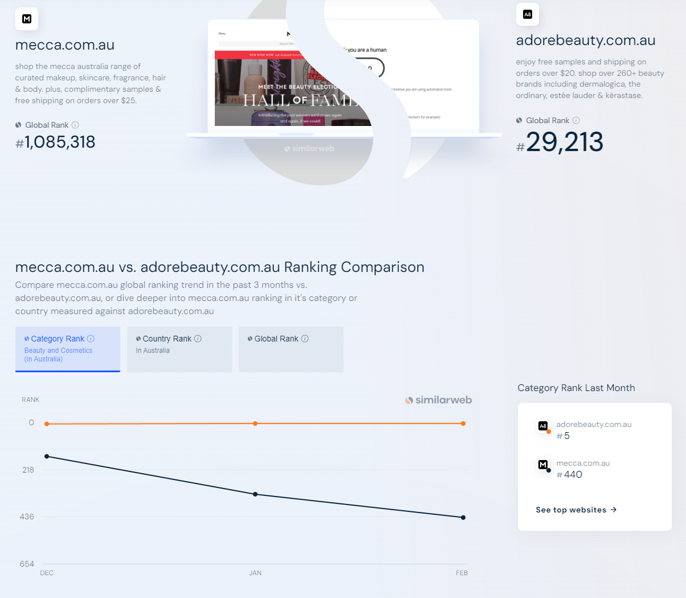

Adore Beauty (ABY.AX) is a leading online beauty retailer in Australia, carving a niche in a fragmented market with a curated selection of top brands and competitive pricing. 

### Category Leader with a Curator's Edge
The Australian online beauty market is vast and fragmented, with numerous brands vying for customer attention. Adore Beauty stands out by acting as a trusted "curator", offering a carefully chosen selection of hair, makeup, fragrance,  cosmetics, and body products from leading names. This curated approach caters to diverse customer needs and preferences.

Beyond brand selection, Adore Beauty disrupts the traditional model by offering lower prices than brick-and-mortar stores.  Australia's retail bricks and mortar format beauty stores often struggle to be profitable due to high rent and labour costs compared to overseas retailers.  Adore Beauty's online model avoids these overhead costs, allowing them to capture market share naturally as they introduce customers to new brands.

### Inflection in Users and Revenue 
The recent half year report indicated a strong return to revenue growth of 7% in one of the most grueling retail periods of Australia where we saw negative growth in retail sales on comps like MYR (-3%).  

### Compelling Retail Value Propositions
Adore Beauty goes beyond just competitive pricing. They've built a strong customer loyalty program with attractive features:

- Free samples: Orders over $50 qualify for free samples, enticing customers to try new products.
- Goodie bags: Orders over $230 come with a goodie bag, adding an element of surprise and value.
- Free express delivery: Orders exceeding $30 enjoy free express delivery, a significant convenience factor.
- Adore Society rewards program: A loyalty program that incentivizes repeat purchases and brand engagement.
- Generous return policy: Customers have a full 130 days to return unwanted items.
- Excellent customer reviews: A stellar 4.4-star rating on productreview.com, a platform known for its stringent review process.
- Unique perks like Tim Tam gifts and review credits: These add a touch of fun and incentivize customer engagement.

### Building a Sustainable Competitive Advantage
In 2023, Adore Beauty launched its own private label brand, AB LAB. This strategic move strengthens their brand portfolio and offers the potential for higher margins in the future.

The company is currently in a growth phase, with projections for significant revenue increases over the next three years (2024-2026).  Additionally, their strong online presence with a blog, podcast, and mobile app (used by 25% of customers) creates a network effect that should reduce customer acquisition costs over time.

Adore Beauty's potential was recognized by THG, a major retailer, who made a buyout offer in 2023. However, the offer was rejected, suggesting the board believes the company is undervalued. Analysts suggest a minimum offer of $1.60 per share.

### Strong Fundamentals and Growth Potential
After a higher cost of living and higher rates lead to slower spend across all beauty category, we predict ABY will recover and capture market share due to their superior pricing, logistics and customer loyalty.
Adore Beauty boasts a loyal customer base with over 800,000 users and 500,000 returning customers.  They have a strong customer lifetime value (LTV) and a relatively low customer acquisition cost (CAC).  We are targeting for scale at 1m customers and average spend of $320AUD per year.

### Several tailwinds favor Adore Beauty's future:

Unsatisfied customers in nearest competitor Mecca is opening the door for ABY to capture share.  Mecca a private company reported around 1bn in revenue ~10% share of the category. 
 
Unsustainable brick-and-mortar model: Traditional beauty stores face increasing pressure due to lower margins compared to online retailers like Adore Beauty.
Founder-led company with long-term vision: The two founders hold a significant stake in the company and are likely committed to its long-term growth.

### Investment Thesis: A Potential Multi-Bagger
Adore Beauty presents a compelling investment opportunity for those seeking exposure to the growing online beauty market. The company offers a unique value proposition to customers, boasts strong financials, and is positioned to benefit from favorable industry trends.

A potential exit price of $5 per share,  compared to a current price of around $1.30, could translate to a 30% IRR over a five-year holding period. This makes Adore Beauty (ABY.AX) a stock worth considering for investors with a long-term outlook.

Disclaimer: This blog post is for informational purposes only and should not be considered financial advice. Please consult with a qualified financial professional before making any investment decisions.
